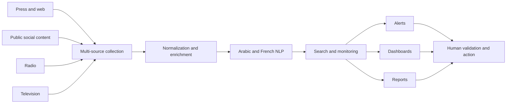

# MONIT — Media Intelligence Platform

MONIT is a media intelligence platform designed to help organizations monitor, organize and understand information from multiple media channels.

MONIT est une plateforme de media intelligence conçue pour aider les organisations à surveiller, organiser et comprendre l'information issue de plusieurs canaux médiatiques.

> This repository is a public product case study. The production source code, infrastructure details and client data are private.

## The problem

Communication, monitoring and analysis teams face a fragmented information environment:

- news and web content are distributed across many sources;
- public social conversations evolve quickly;
- radio and television add formats that are harder to search;
- Arabic and French content require appropriate language processing;
- decision-makers need clear signals, not another unstructured content feed.

## The product

MONIT brings available information into a common monitoring workflow. Depending on source availability, the platform can cover:

- online press and web sources;
- publicly accessible social media content;
- radio and television content;
- tracked entities, themes and keywords;
- alerts, dashboards and reporting;
- AI-assisted organization and analysis.

The objective is not to replace analysts. Automation accelerates collection and organization; human expertise remains essential for validation, interpretation and decisions.

## Product workflow

This diagram presents the functional product flow only. It intentionally excludes production topology, vendors, credentials and security-sensitive implementation details.

## Core capabilities

| Capability | Purpose |
|---|---|
| **Multi-source monitoring** | Bring relevant media signals into one working environment |
| **Search and filtering** | Explore information by topic, source, actor and period |
| **Alerts** | Notify teams when tracked signals appear or evolve |
| **Dashboards** | Provide a shared operational view for monitoring teams |
| **Reporting** | Turn collected information into material for teams and decision-makers |
| **AI-assisted analysis** | Support classification, enrichment and faster exploration |
| **Arabic and French NLP** | Better address multilingual monitoring needs in Morocco and other markets |

## Two complementary experiences

### [monit.ma](https://monit.ma)

The Moroccan offer, with attention to the local media environment and Arabic and French content, according to available sources.

### [monit.media](https://monit.media)

The international and multilingual experience for organizations monitoring more than one market.

## My contribution

I conceived and built MONIT as a product combining media monitoring, data workflows, multilingual processing, alerts, dashboards and reporting.

My work covers product definition, system design, development, source integration, deployment and continuous evolution.

MONIT is edited and operated by [AL LABS](https://allabs.ma).

## Product principles

- **Useful signals over raw volume**
- **Multilingual context over literal processing**
- **Traceable information over opaque conclusions**
- **Human validation for important decisions**
- **Privacy and source availability as design constraints**

## Portfolio roadmap

- [ ] Add anonymized product screenshots
- [ ] Publish a short guided demonstration
- [ ] Document a synthetic monitoring scenario
- [ ] Add a non-confidential functional architecture note
- [ ] Publish selected lessons about Arabic and French media processing

## Links

- [MONIT Morocco](https://monit.ma)
- [MONIT International](https://monit.media)
- [AL LABS](https://allabs.ma)
- [Mohamed-Yassine Belatar on GitHub](https://github.com/mybelatar)
- [Mohamed-Yassine Belatar on LinkedIn](https://www.linkedin.com/in/mohamed-yassine-belatar-996772267/)

## Usage

This repository documents a proprietary product. No production code, client data or confidential integration details are provided. The documentation may not be represented as an open-source release of MONIT.
